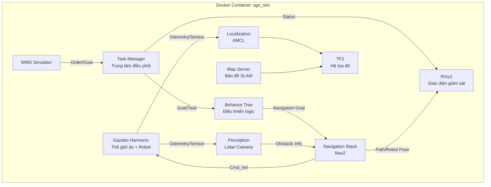

# **Thiết kế Hệ thống AGV cho Kho thông minh sử dụng Docker, ROS2 và Gazebo**

## **Phần 1: User Story (Các tình huống AGV gặp phải)**

**Môi trường giả lập & có thể giả lập trong thực tế:**

1. **Vận chuyển hàng đơn lẻ:** Là người điều hành, tôi muốn gửi lệnh cho một AGV di chuyển từ `Vị trí A` (ví dụ: khu nhập kho) đến `Vị trí B` (ví dụ: kệ chứa X) để mang theo một `kiện hàng`, giúp tự động hóa việc di chuyển hàng hóa.
2. **Tránh vật cản động/tĩnh:** Là AGV, trong khi đang di chuyển, tôi phải phát hiện và tránh các vật cản bất ngờ (như người, xe đẩy, hàng rơi) hoặc vật cản cố định (cột, tường) để đảm bảo an toàn.
3. **Định vị & Bám sát lộ trình:** Là AGV, tôi cần biết chính xác vị trí của mình trên bản đồ kho (dù có sai lệch nhỏ do trượt bánh) và điều chỉnh để bám sát tuyến đường đã định.
4. **Sạc pin tự động:** Là AGV, khi pin xuống dưới ngưỡng 20%, tôi cần tự động tìm đường đến `Trạm sạc` và trở lại nhiệm vụ sau khi sạc đủ.
5. **Nhận diện & Tương tác với kệ hàng:** Là AGV, khi đến đúng kệ hàng, tôi cần "nhận diện" kệ (qua AR tag/QR code giả lập) và thực hiện thao tác "nâng" hoặc "hạ" kiện hàng (mô phỏng bằng animation).
6. **Xử lý lỗi & Phục hồi:** Là AGV, nếu bị mắc kẹt không thể di chuyển sau một thời gian X giây, tôi cần thông báo lỗi cho hệ thống và thử một lộ trình thay thế.
7. **Tích hợp với Hệ thống Quản lý Kho (WMS - mô phỏng):** Là hệ thống điều hành, tôi muốn nhận `Đơn hàng` từ một server WMS giả lập, tự động phân công nhiệm vụ tối ưu cho AGV và cập nhật trạng thái kho.

---

## **Phần 2: Kiến trúc Kỹ thuật & Công nghệ Dự kiến (Docker-based)**

### **A. Công nghệ Nền tảng**

| Thành phần | Phiên bản/Lựa chọn | Mục đích |
|------------|-------------------|----------|
| **Hệ điều hành Host** | Ubuntu 22.04+ / Windows WSL2 | Khuyến nghị Ubuntu hoặc WSL2 |
| **Docker Engine** | ≥ 20.10 | Container runtime |
| **Docker Compose** | ≥ 2.20 | Điều phối container |
| **NVIDIA Container Toolkit** | (Optional) | Nếu dùng GPU cho Gazebo |
| **ROS2 Distro** | **ROS2 Jazzy** | Latest stable release |
| **Gazebo** | **Gazebo Harmonic** | Gazebo Ignition với ROS2 Jazzy |
| **Robot Model** | **TurtleBot3 Waffle Pi** | Có camera và lidar |

### **B. Cấu trúc Docker Single Container**

```
HOST MACHINE
└── Docker Container: agv_sim
    ├── ROS2 Jazzy Core
    ├── Gazebo Harmonic Server
    ├── Navigation Stack (Nav2)
    ├── SLAM Toolbox
    ├── Task Manager
    ├── Custom Nodes
    └── GUI Tools (RViz2)
```

**Lợi ích của Single Container:**
- Đơn giản hóa setup và deployment
- Dễ dàng phát triển và debug
- Giảm overhead network giữa containers
- Phù hợp cho single-robot development

### **C. Cấu trúc Workspace với Docker**

```
AGV_2/
├── docker/
│   ├── Dockerfile              # Single container Dockerfile
│   ├── entrypoint.sh          # Entrypoint script
│   ├── requirements.txt       # Python dependencies
│   └── docker-compose.yml     # Docker Compose configuration
├── src/                        # ROS2 workspace source
│   ├── agv_warehouse/         # Main custom package (tạo sau)
│   ├── turtlebot3/            # Cloned repository
│   ├── turtlebot3_simulations/
│   ├── slam_toolbox/
│   └── navigation2/
├── config/                     # Configuration files
│   ├── nav2_params.yaml       # Nav2 parameters
│   └── maps/                  # Map files
├── data/                       # Persistent data
│   ├── logs/
│   ├── bags/
│   └── maps/
├── scripts/                    # Utility scripts
│   ├── setup.sh
│   └── run_dev.sh
├── .env                       # Environment variables
├── .dockerignore
├── .gitignore
└── README.md
```

---

## **Phần 3: Kiến trúc Tổng thể & Mô tả**



**Giải thích các thành phần:**

1. **Container `agv_sim`:**
   - Chứa toàn bộ ROS2 Jazzy core và Gazebo Harmonic
   - Chạy các nodes điều khiển, điều hướng, quản lý nhiệm vụ
   - Single container đơn giản, dễ phát triển

2. **Shared Volumes:**
   - `src/`: Code source được mount từ host để phát triển
   - `config/`: Configuration files (Nav2 params, maps)
   - `data/`: Dữ liệu persistent (maps, logs, bags)

3. **Network:**
   - Sử dụng `host` network mode để đảm bảo ROS2 communication tốt nhất

---

## **Phần 4: Docker Configuration Files**

### **A. docker/docker-compose.yml**

```yaml
# AGV Simulation Docker Compose
# ROS 2 Jazzy + Gazebo Harmonic
# Single container setup (like AGV_1 and ROBOTIS)

services:
  agv_sim:
    build:
      context: .
      dockerfile: Dockerfile
    container_name: agv_simulation
    
    # Enable GUI (X11 forwarding)
    environment:
      - DISPLAY=${DISPLAY}
      - QT_X11_NO_MITSHM=1
      - NVIDIA_VISIBLE_DEVICES=all
      - NVIDIA_DRIVER_CAPABILITIES=all
      - ROS_DOMAIN_ID=${ROS_DOMAIN_ID:-0}
      - TURTLEBOT3_MODEL=${TURTLEBOT3_MODEL:-waffle_pi}
    
    volumes:
      # X11 socket for GUI
      - /tmp/.X11-unix:/tmp/.X11-unix:rw
      # Source code (for development)
      - ../src:/ros2_ws/src:rw
      # Config directory
      - ../config:/ros2_ws/config:rw
      # Data directory
      - ../data:/ros2_ws/data:rw
      # Maps directory
      - ../data/maps:/ros2_ws/maps:rw
    
    # Network mode for ROS 2 communication
    network_mode: host
    
    # NVIDIA GPU support
    deploy:
      resources:
        reservations:
          devices:
            - driver: nvidia
              count: all
              capabilities: [gpu, graphics, display]
    
    # Interactive mode
    stdin_open: true
    tty: true
    
    # Privileged mode for hardware access
    privileged: true
    
    # Runtime for NVIDIA
    runtime: nvidia
    
    command: bash
```

### **B. docker/Dockerfile**

```dockerfile
# AGV Simulation Dockerfile
# ROS 2 Jazzy + Gazebo Harmonic
# Single container setup (like AGV_1 and ROBOTIS)
FROM osrf/ros:jazzy-desktop-full

# Set environment variables
ENV DEBIAN_FRONTEND=noninteractive
ENV ROS_DISTRO=jazzy

# Install dependencies
RUN apt-get update && apt-get install -y \
    ros-${ROS_DISTRO}-slam-toolbox \
    ros-${ROS_DISTRO}-navigation2 \
    ros-${ROS_DISTRO}-nav2-bringup \
    ros-${ROS_DISTRO}-ros-gz \
    ros-${ROS_DISTRO}-ros-gz-sim \
    ros-${ROS_DISTRO}-ros-gz-bridge \
    ros-${ROS_DISTRO}-ros-gz-image \
    ros-${ROS_DISTRO}-turtlebot3* \
    ros-${ROS_DISTRO}-turtlebot3-teleop \
    ros-${ROS_DISTRO}-robot-state-publisher \
    ros-${ROS_DISTRO}-joint-state-publisher \
    ros-${ROS_DISTRO}-joint-state-publisher-gui \
    ros-${ROS_DISTRO}-xacro \
    ros-${ROS_DISTRO}-rviz2 \
    ros-${ROS_DISTRO}-tf2-ros \
    ros-${ROS_DISTRO}-tf2-tools \
    ros-${ROS_DISTRO}-teleop-twist-keyboard \
    ros-${ROS_DISTRO}-nav2-msgs \
    python3-pip \
    python3-colcon-common-extensions \
    git \
    vim \
    && rm -rf /var/lib/apt/lists/*

# Install Python dependencies
# Note: numpy, pyyaml, pytest, matplotlib are already installed via apt
# Use --ignore-installed to avoid conflicts with apt-installed packages
RUN pip3 install --no-cache-dir --break-system-packages --ignore-installed \
    transforms3d \
    opencv-python \
    websockets

# Create workspace
WORKDIR /ros2_ws

# Setup entrypoint
COPY entrypoint.sh /entrypoint.sh
RUN chmod +x /entrypoint.sh

# Auto source ROS 2 in bash
RUN echo "source /opt/ros/jazzy/setup.bash" >> ~/.bashrc && \
    echo "source /ros2_ws/install/setup.bash 2>/dev/null || true" >> ~/.bashrc && \
    echo "export ROS_DOMAIN_ID=0" >> ~/.bashrc && \
    echo "export TURTLEBOT3_MODEL=waffle_pi" >> ~/.bashrc

ENTRYPOINT ["/entrypoint.sh"]
CMD ["bash"]
```

### **C. docker/entrypoint.sh**

```bash
#!/bin/bash
set -e

# Source ROS 2
source /opt/ros/jazzy/setup.bash

# Source workspace if built
if [ -f /ros2_ws/install/setup.bash ]; then
    source /ros2_ws/install/setup.bash
fi

# Execute command
exec "$@"
```

### **D. docker/requirements.txt**

```
transforms3d
opencv-python
websockets
```

---

## **Phần 5: Lộ trình Phát triển theo Giai đoạn**

### **Giai đoạn 1: Thiết lập Docker & Môi trường Cơ bản** ✅
*   **Mục tiêu:** Chạy được ROS2 và Gazebo trong Docker
*   **Công việc:**
    1.  Cài đặt Docker và Docker Compose trên host
    2.  Build và chạy container
    3.  Kiểm tra kết nối ROS2 và Gazebo
    4.  Test spawn robot TurtleBot3 trong empty world
*   **Kết quả:** Hệ thống Docker chạy, có thể khởi động Gazebo và ROS2, robot spawn thành công

### **Giai đoạn 2: Điều hướng Cơ bản 1 AGV**
*   **Mục tiêu:** AGV có thể di chuyển tự động từ điểm A đến điểm B trong bản đồ kho

#### **2.1. Tạo bản đồ kho với SLAM (Simultaneous Localization and Mapping)**

**Mục tiêu:** Tạo bản đồ kho hàng từ môi trường giả lập

**Công việc chi tiết:**

1. **Chuẩn bị môi trường Gazebo:**
   - Tạo hoặc sử dụng warehouse world có sẵn (turtlebot3_house, turtlebot3_world)
   - Đảm bảo world có đủ vật cản và cấu trúc để tạo bản đồ có ý nghĩa
   - Kiểm tra robot spawn đúng vị trí

2. **Cấu hình SLAM Toolbox:**
   - Tạo file config: `config/slam_params.yaml`
   - Cấu hình các tham số:
     - `map_update_rate`: Tần suất cập nhật bản đồ
     - `scan_topic`: Topic lidar scan (`/scan`)
     - `base_frame`: Frame của robot (`base_footprint`)
     - `map_frame`: Frame của bản đồ (`map`)
     - `odom_frame`: Frame odometry (`odom`)
   - Tối ưu cho TurtleBot3 Waffle Pi (lidar range, resolution)

3. **Launch SLAM:**
   - Tạo launch file: `src/agv_warehouse/launch/slam.launch.py`
   - Launch các nodes:
     - Gazebo world
     - Robot spawn
     - SLAM Toolbox node
     - RViz2 với config hiển thị map, robot pose, scan
   - Test với teleop để di chuyển robot khắp môi trường

4. **Mapping Process:**
   - Di chuyển robot khắp khu vực cần map
   - Quan sát bản đồ được tạo real-time trong RViz2
   - Đảm bảo bản đồ bao phủ toàn bộ khu vực quan trọng
   - Kiểm tra chất lượng bản đồ (không có lỗ hổng lớn, vật cản rõ ràng)

5. **Lưu bản đồ:**
   - Sử dụng `map_saver` node để lưu bản đồ
   - Lưu vào `data/maps/warehouse_map.pgm` và `warehouse_map.yaml`
   - Kiểm tra file map có thể load lại được

**Deliverables:**
- File config SLAM: `config/slam_params.yaml`
- Launch file SLAM: `src/agv_warehouse/launch/slam.launch.py`
- Bản đồ đã tạo: `data/maps/warehouse_map.pgm` và `warehouse_map.yaml`
- RViz2 config: `config/slam.rviz`

#### **2.2. Cấu hình Nav2 cho TurtleBot3**

**Mục tiêu:** Cấu hình Nav2 stack để robot có thể navigate trong bản đồ đã tạo

**Công việc chi tiết:**

1. **Cấu hình Nav2 Parameters:**
   - Tạo file: `config/nav2_params.yaml`
   - Cấu hình các components:
     - **Planner Server:**
       - `planner_plugin`: `nav2_navfn_planner/NavfnPlanner` hoặc `nav2_smac_planner/SmacPlanner`
       - `tolerance`: Độ chính xác khi đến goal
       - `use_astar`: Sử dụng A* algorithm
     - **Controller Server:**
       - `controller_plugin`: `dwb_core::DWBLocalPlanner`
       - `max_vel_x`, `min_vel_x`: Vận tốc tối đa/tối thiểu
       - `max_vel_theta`, `min_vel_theta`: Vận tốc góc
       - `acc_lim_x`, `acc_lim_theta`: Gia tốc giới hạn
     - **Recovery Server:**
       - `spin`, `backup`, `wait`: Các recovery behaviors
     - **BT Navigator:**
       - `default_nav_to_pose_bt_xml`: Behavior tree file
       - `default_nav_through_poses_bt_xml`: Behavior tree cho multiple waypoints
     - **Costmap:**
       - `global_costmap` và `local_costmap`:
         - `obstacle_layer`: Lớp vật cản từ lidar
         - `inflation_layer`: Lớp mở rộng vật cản
         - `resolution`: Độ phân giải costmap (0.05m)
         - `update_frequency`: Tần suất cập nhật

2. **Tạo Behavior Trees:**
   - Copy default BT từ Nav2: `config/nav2_bt_navigation.xml`
   - Tùy chỉnh nếu cần:
     - Thêm recovery behaviors
     - Điều chỉnh timeout
     - Thêm custom conditions/actions

3. **Cấu hình Robot Model:**
   - Đảm bảo URDF của TurtleBot3 được load đúng
   - Kiểm tra TF tree: `ros2 run tf2_tools view_frames`
   - Verify frames: `map` -> `odom` -> `base_footprint` -> `base_link`

4. **Test Nav2 Components:**
   - Test planner: `ros2 action send_goal /navigate_to_pose ...`
   - Test controller: Kiểm tra cmd_vel được publish đúng
   - Test recovery: Tạo tình huống robot bị kẹt

**Deliverables:**
- Nav2 config: `config/nav2_params.yaml`
- Behavior tree: `config/nav2_bt_navigation.xml`
- TF tree diagram: `data/logs/tf_tree.pdf`

#### **2.3. Viết Launch Files cho Single-Robot Navigation**

**Mục tiêu:** Tạo launch files hoàn chỉnh để chạy navigation system

**Công việc chi tiết:**

1. **Launch File: Navigation Stack:**
   - Tạo: `src/agv_warehouse/launch/navigation.launch.py`
   - Include các components:
     - Map server (load bản đồ đã tạo)
     - AMCL (Adaptive Monte Carlo Localization)
     - Nav2 bringup (planner, controller, recovery, BT navigator)
     - RViz2 với navigation config
   - Parameters:
     - Map file path
     - Initial pose (nếu cần)
     - Use sim time (true cho Gazebo)

2. **Launch File: Full System:**
   - Tạo: `src/agv_warehouse/launch/full_system.launch.py`
   - Include:
     - Gazebo world launch
     - Robot spawn
     - Navigation stack
   - Arguments:
     - `world`: Chọn world file
     - `map`: Chọn map file
     - `use_sim_time`: True

3. **Cấu hình AMCL:**
   - File: `config/amcl_params.yaml`
   - Parameters:
     - `initial_pose_x`, `initial_pose_y`, `initial_pose_a`
     - `laser_model_type`: `likelihood_field`
     - `odom_model_type`: `diff`
     - `update_min_d`: Khoảng cách tối thiểu để update
     - `update_min_a`: Góc tối thiểu để update
     - `min_particles`, `max_particles`: Số lượng particles

4. **RViz2 Configuration:**
   - Tạo: `config/navigation.rviz`
   - Displays:
     - Map
     - Robot model
     - Laser scan
     - Path (global và local)
     - Goal pose
     - Particle cloud (AMCL)
     - Costmaps (global và local)

**Deliverables:**
- Launch file navigation: `src/agv_warehouse/launch/navigation.launch.py`
- Launch file full system: `src/agv_warehouse/launch/full_system.launch.py`
- AMCL config: `config/amcl_params.yaml`
- RViz2 config: `config/navigation.rviz`

#### **2.4. Test với RViz2 Navigation Goal**

**Mục tiêu:** Kiểm tra toàn bộ hệ thống navigation hoạt động đúng

**Công việc chi tiết:**

1. **Start Full System:**
   ```bash
   # Trong container
   ros2 launch agv_warehouse full_system.launch.py
   ```

2. **Kiểm tra Topics:**
   - Verify các topics quan trọng:
     - `/map`: Bản đồ được publish
     - `/scan`: Lidar data
     - `/odom`: Odometry
     - `/cmd_vel`: Velocity commands
     - `/amcl_pose`: Robot pose từ AMCL
     - `/plan`: Global path
     - `/local_plan`: Local path

3. **Set Initial Pose:**
   - Trong RViz2, sử dụng "2D Pose Estimate" tool
   - Click vào vị trí robot trên map
   - Quan sát particle cloud converge
   - Verify robot pose trong RViz2 khớp với Gazebo

4. **Send Navigation Goal:**
   - Sử dụng "2D Nav Goal" tool trong RViz2
   - Click điểm đích trên map
   - Quan sát:
     - Global path được tính toán
     - Robot bắt đầu di chuyển
     - Local planner điều chỉnh path
     - Robot đến đúng goal

5. **Test Scenarios:**
   - **Scenario 1: Simple navigation**
     - Goal trong line of sight
     - Robot đi thẳng đến goal
   - **Scenario 2: Navigation với vật cản**
     - Goal sau vật cản
     - Robot phải đi vòng
   - **Scenario 3: Narrow passage**
     - Goal qua lối đi hẹp
     - Robot phải điều chỉnh chính xác
   - **Scenario 4: Recovery behavior**
     - Tạo tình huống robot bị kẹt
     - Verify recovery behaviors hoạt động (spin, backup)

6. **Performance Metrics:**
   - Thời gian tính toán path
   - Độ chính xác khi đến goal
   - Smoothness của trajectory
   - Recovery time khi bị kẹt

**Deliverables:**
- Test report: `data/logs/navigation_test_report.md`
- Video demo navigation
- Screenshots của các scenarios

#### **2.5. Tối ưu hóa và Debug**

**Mục tiêu:** Tối ưu performance và fix các vấn đề

**Công việc chi tiết:**

1. **Tune Parameters:**
   - Điều chỉnh velocity limits dựa trên test
   - Tune costmap inflation radius
   - Optimize planner parameters
   - Fine-tune AMCL particles

2. **Debug Tools:**
   - Sử dụng `ros2 topic echo` để monitor topics
   - Sử dụng `ros2 node list` và `ros2 node info` để debug nodes
   - Check TF tree với `tf2_tools`
   - Monitor CPU/RAM usage

3. **Documentation:**
   - Ghi lại các parameters đã tune
   - Document các issues và solutions
   - Tạo troubleshooting guide

**Deliverables:**
- Optimized config files
- Troubleshooting guide: `docs/troubleshooting.md`
- Performance benchmarks

*   **Kết quả:** AGV có thể nhận navigation goal từ RViz2, tính toán path, di chuyển an toàn đến đích, và xử lý các tình huống recovery

### **Giai đoạn 4: Logistics Operations**
*   **Mục tiêu:** AGV thực hiện nhiệm vụ "pick and place"
*   **Công việc:**
    1.  Thêm model kệ hàng, kiện hàng vào Gazebo
    2.  Triển khai AR tag detection (sử dụng camera)
    3.  Viết Behavior Trees cho pick/delivery operations
    4.  Thêm plugin mô phỏng cơ cấu nâng (lift mechanism)
*   **Kết quả:** AGV hoàn thành chu trình nhận/delivery hàng

### **Giai đoạn 5: Hệ thống Hoàn chỉnh**
*   **Mục tiêu:** Tích hợp WMS, task manager, và monitoring
*   **Công việc:**
    1.  Phát triển Task Manager (Python node)
    2.  Tạo WMS simulator (REST API)
    3.  Thêm trạm sạc và quản lý pin
    4.  Tích hợp Foxglove Studio dashboard
*   **Kết quả:** Hệ thống kho thông minh hoàn chỉnh

---

## **Phần 6: Deployment & Development Workflow**

### **Development Workflow:**

1. **Local Development:**
   ```bash
   # Start development environment
   cd AGV_2/docker
   docker compose up -d
   
   # Enter container
   ./scripts/run_dev.sh enter
   
   # Build workspace
   cd /ros2_ws
   colcon build --symlink-install
   
   # Source workspace
   source install/setup.bash
   ```

2. **Persistent Data Management:**
   ```bash
   # Maps are saved in data/maps/
   # Logs in data/logs/
   # ROS bags in data/bags/
   ```

### **Production Considerations:**

1. **Performance:**
   - Sử dụng GPU passthrough cho Gazebo
   - Tune Docker resource limits
   - Sử dụng host network mode cho low latency

2. **Monitoring:**
   - Prometheus + Grafana cho metrics
   - ELK stack cho logging
   - Health checks trong docker-compose

3. **CI/CD:**
   - GitHub Actions để build và test containers
   - Container registry (Docker Hub, GitHub Container Registry)
   - Automated deployment scripts

---

## **Phần 7: Tài liệu tham khảo & Next Steps**

### **Tài liệu tham khảo:**
1. [ROS2 Jazzy Documentation](https://docs.ros.org/en/jazzy/)
2. [Nav2 Documentation](https://navigation.ros.org/)
3. [Gazebo Harmonic Documentation](https://gazebosim.org/docs)
4. [TurtleBot3 Manual](https://emanual.robotis.com/docs/en/platform/turtlebot3/overview/)
5. [SLAM Toolbox Documentation](https://github.com/SteveMacenski/slam_toolbox)

### **Next Steps để bắt đầu:**

1. **Build và chạy Docker:**
   ```bash
   cd AGV_2/docker
   docker compose build
   docker compose up -d
   ```

2. **Bắt đầu với Giai đoạn 2:**
   ```bash
   # Enter container
   ./scripts/run_dev.sh enter
   
   # Test Gazebo
   export TURTLEBOT3_MODEL=waffle_pi
   ros2 launch turtlebot3_gazebo empty_world.launch.py
   ```

**Thiết kế này cung cấp một hệ thống hoàn chỉnh, đơn giản và dễ dàng phát triển với Docker single container. Bạn có thể bắt đầu triển khai từng phần theo lộ trình đã định!**
