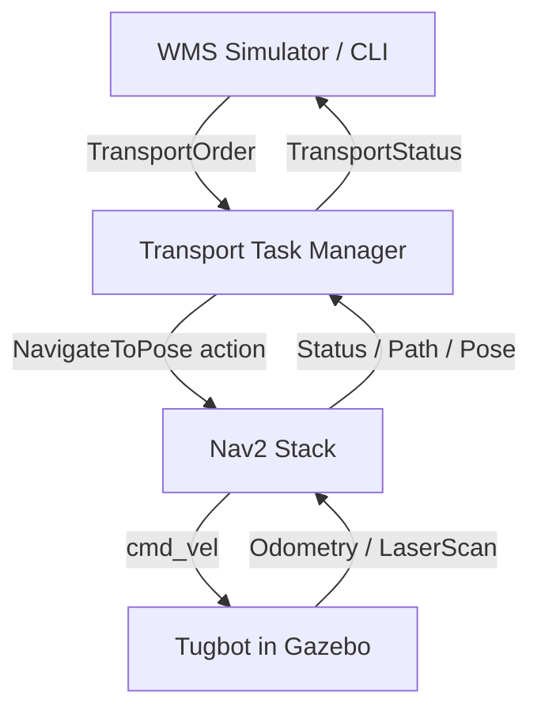

# **Phase 4 – Thiết kế & Implement tính năng vận chuyển hàng trên map đã scan**

## 1. **Mục tiêu của Phase 4**

Sau khi đã hoàn thành **scan map kho** bằng `agv_auto_explore` và lưu map tĩnh vào `data/maps/`, phase này tập trung vào:

- **Sử dụng lại map đã scan** để robot **định vị và điều hướng Nav2** thay vì tiếp tục explore.
- **Thiết kế & implement luồng vận chuyển hàng** từ **điểm A → điểm B** trên map:
  - Nhận nhiệm vụ (order) từ một nguồn bên ngoài (WMS giả lập / CLI / GUI).
  - Chuyển đổi nhiệm vụ thành **chuỗi goal Nav2** (pickup → dropoff → về trạm nếu cần).
  - Đảm bảo **an toàn, tránh va chạm**, xử lý lỗi (khi Nav2 abort, khi robot kẹt, khi map bị che khuất tạm thời).
- Kết nối rõ ràng với user story trong `AGV_Design.md`:
  - **User story #1**: Vận chuyển hàng đơn lẻ (A→B).
  - **User story #2**: Tránh vật cản động/tĩnh.
  - **User story #3**: Định vị & bám sát lộ trình.

---

## 2. **Tận dụng map đã scan trong `data/maps/`**

### 2.1. **Nguồn map hiện tại**

- Map tĩnh dùng cho Nav2 **đã được chuẩn hóa sẵn** và nằm trong `data/maps/`:
  - `data/maps/warehouse_tugbot_20251218_173014.pgm`
  - `data/maps/warehouse_tugbot_20251218_173014.yaml`
- Vì vậy, **không cần thực hiện bước convert từ `.pbstream` sang `.pgm + .yaml` nữa trong phase này.**

### 2.2. **Chuẩn hóa map cho Nav2 (convert sang OccupancyGrid)**

Trong bối cảnh hiện tại, mục này chỉ dùng để **mô tả kiến trúc chung**, vì việc convert đã hoàn tất:

- Nav2 sẽ sử dụng trực tiếp file YAML:  
  - `yaml_filename: data/maps/warehouse_tugbot_20251218_173014.yaml`
- Bên trong file YAML đã chỉ tới ảnh map tương ứng (`warehouse_tugbot_20251218_173014.pgm`) kèm `resolution`, `origin`, `occupied_thresh`, `free_thresh`, `negate`, v.v.
- Khi launch Nav2, chỉ cần truyền đúng đường dẫn YAML, không cần thêm bước xử lý map nào khác.

> **Kết luận**: Phase 4 sẽ **không chạy `agv_auto_explore` nữa**, mà sử dụng **Nav2 + map tĩnh** lấy từ `data/maps/`.

---

## 3. **Package `agv_transport` – tách riêng logic vận chuyển**

### 3.1. **Mục tiêu tách package**

- Gom toàn bộ logic **vận chuyển hàng trên map tĩnh** vào một package ROS2 riêng: `src/agv_transport/`.
- Tách bạch với `agv_auto_explore` (dùng cho scan map) để dễ bảo trì, build, test và deploy.

### 3.2. **Cấu trúc dự kiến của `agv_transport`**

Trong `src/agv_transport/`:

```text
agv_transport/
  agv_transport/
    __init__.py
    transport_task_manager_node.py   # Node ROS2 chính quản lý nhiệm vụ
    battery_manager.py               # Logic battery & auto-charging
    station_manager.py               # Đọc YAML stations, helper lookup
    messages.py                      # Kiểu dữ liệu python cho TransportOrder (nếu dùng rclpy + JSON)
  config/
    warehouse_stations.yaml          # Định nghĩa stations (dock, shelf, charger, ...)
    tugbot_nav2_transport_params.yaml# (optional) override params Nav2 cho transport
  launch/
    transport_with_nav.launch.py     # Launch Nav2 + transport_task_manager
  package.xml
  setup.cfg
  setup.py
  resource/
    agv_transport
  test/
    test_battery_manager.py
    test_station_manager.py
    test_task_queue.py
```

### 3.3. **Trách nhiệm các module chính**

- `transport_task_manager_node.py`:
  - Sub/Pub các topic: `agv/transport_orders`, `agv/transport_status`.
  - Action client `NavigateToPose` (Nav2).
  - Quản lý **FSM**: `IDLE`, `GO_PICKUP`, `WAIT_LOADING`, `GO_DROPOFF`, `WAIT_UNLOADING`, `DONE`, `GO_CHARGING`.
  - Làm việc với `battery_manager` để quyết định khi nào cần thêm task về trạm sạc.
- `battery_manager.py`:
  - Giả lập mức pin (0–100%) dựa trên quãng đường và thời gian di chuyển.
  - Khi pin ≤ 20%: sinh ra **task internal** `GO_CHARGING` (nhưng ưu tiên **hoàn thành task giao hàng đang dở** trước nếu còn an toàn).
- `station_manager.py`:
  - Đọc `warehouse_stations.yaml`.
  - Cung cấp API: `get_pose(station_name)`, `get_closest_station(type, current_pose)`, v.v.

---

## 4. **Thiết kế GUI Task Manager (FastAPI + HTML/CSS/JS)**

### 4.1. **Kiến trúc tổng thể**

- **Backend**: `FastAPI` chạy trong cùng container (hoặc service riêng) với ROS2, đóng vai trò:
  - REST API cho GUI (HTTP/JSON).
  - Bridge giữa HTTP và ROS2 (pub/sub, gửi action, đọc status).
  - **Template rendering**: sử dụng Jinja2 để render HTML templates trực tiếp.
- **Frontend**: HTML/CSS/JS vanilla đơn giản, không cần build process:
  - Templates được render server-side bởi FastAPI.
  - JavaScript vanilla cho tương tác real-time (fetch API, WebSocket optional).

Sơ đồ luồng:

```text
Browser  <--HTML/CSS/JS-->  FastAPI (Jinja2)  <--rclpy-->  agv_transport nodes
```

### 4.2. **Các API chính của FastAPI**

- **Orders**:
  - `POST /api/orders`:
    - Body: `{ pickup_station, dropoff_station, priority? }`.
    - Hành vi: tạo `TransportOrder` mới, publish vào `agv/transport_orders`.
  - `GET /api/orders`:
    - Trả về danh sách order trong queue + trạng thái (queued, running, done, failed).
- **AGV status**:
  - `GET /api/status`:
    - Thông tin: `current_task`, `queue_length`, `battery_level`, `state` (IDLE/GO_PICKUP/...).
- **Stations**:
  - `GET /api/stations`:
    - Đọc từ `warehouse_stations.yaml` để show trong dropdown của UI.

### 4.3. **Giao diện HTML tối giản**

**Cấu trúc templates:**
```text
templates/
  base.html          # Layout chung
  dashboard.html     # Trang chính
static/
  css/
    style.css        # CSS đơn giản
  js/
    dashboard.js     # JavaScript vanilla cho tương tác
```

**Trang chính (`dashboard.html`) gồm:**
- **Form tạo task**:
  - Dropdown `pickup_station`, `dropoff_station` (load từ `/api/stations`).
  - Nút `Create Transport Task` → fetch `POST /api/orders`.
- **Danh sách task**:
  - Bảng hiển thị `id`, pickup, dropoff, trạng thái, thời gian tạo.
  - Auto-refresh mỗi 2-3 giây bằng `setInterval()`.
- **Panel trạng thái AGV**:
  - Hiển thị `battery_level`, `current_state`, `current_station`, task đang chạy.
  - Progress bar cho battery level.

> Giao diện chỉ cần đơn giản, tập trung vào **quan sát queue** và **tạo task**; phần hiển thị map có thể để gánh cho RViz2.

---

## 5. **Các giai đoạn phát triển Phase 4**

### 5.1. **Giai đoạn 1: Cơ sở hạ tầng (Infrastructure)**
- **Mục tiêu**: Thiết lập Nav2 với map tĩnh và cấu trúc package cơ bản.
- **Deliverables**:
  - Package `agv_transport` với cấu trúc cơ bản.
  - Launch file Nav2 với map tĩnh từ `data/maps/`.
  - File cấu hình `warehouse_stations.yaml` với các station cơ bản.
- **Thời gian ước tính**: 2-3 ngày.

### 5.2. **Giai đoạn 2: Task Manager cơ bản (Core Logic)**
- **Mục tiêu**: Implement FSM và logic vận chuyển đơn giản.
- **Deliverables**:
  - `transport_task_manager_node.py` với FSM cơ bản.
  - Tích hợp Nav2 action client.
  - Test với CLI commands (không cần GUI).
- **Thời gian ước tính**: 3-4 ngày.

### 5.3. **Giai đoạn 3: GUI và API (User Interface)**
- **Mục tiêu**: Tạo giao diện web đơn giản để tạo và theo dõi tasks.
- **Deliverables**:
  - FastAPI server với templates HTML.
  - REST API endpoints cơ bản.
  - Dashboard đơn giản với form tạo task.
- **Thời gian ước tính**: 2-3 ngày.

### 5.4. **Giai đoạn 4: Battery và Auto-charging (Advanced Features)**
- **Mục tiêu**: Thêm logic battery management và auto-charging.
- **Deliverables**:
  - `battery_manager.py` với simulation battery.
  - Logic auto-charging khi battery thấp.
  - Tích hợp charging station.
- **Thời gian ước tính**: 2-3 ngày.

### 5.5. **Giai đoạn 5: QR Code Integration (Cargo Handling)**
- **Mục tiêu**: Tích hợp quét QR code để xác nhận pickup/dropoff.
- **Deliverables**:
  - Camera integration cho QR scanning.
  - QR code validation logic.
  - Update FSM để handle QR confirmation.
- **Thời gian ước tính**: 3-4 ngày.

### 5.6. **Giai đoạn 6: Testing và Optimization (Polish)**
- **Mục tiêu**: Test tổng thể, xử lý edge cases, tối ưu performance.
- **Deliverables**:
  - Comprehensive testing scenarios.
  - Error handling improvements.
  - Performance tuning.
- **Thời gian ước tính**: 2-3 ngày.

---

## 6. **Thiết kế hệ tọa độ & các điểm giao nhận hàng trên map**

---

## 3. **Kiến trúc Nav2 cho vận chuyển hàng**

### 3.1. **Thành phần Nav2 liên quan**

- `map_server` (Nav2 Map Server)
- `amcl` (Localization trên map tĩnh)
- `nav2_bt_navigator` (Behavior Tree điều hướng)
- `nav2_planner`, `nav2_controller`, `nav2_recoveries`
- `waypoint_follower` (optional nếu muốn đi qua trung gian)
- `lifecycle_manager` cho Nav2

Các thành phần này sẽ chạy tương tự khi explore, nhưng **input goal** không phải từ frontier planner nữa, mà từ **Task Manager vận chuyển** (xem mục 5).

### 3.2. **Sử dụng lại cấu hình Nav2 trong `agv_auto_explore`**

Trong `src/agv_auto_explore/config/` đang có:

- `tugbot_nav2_params.yaml`

**Chiến lược phase 4:**

- **Tái sử dụng** `tugbot_nav2_params.yaml` như base cho cấu hình vận chuyển.
- Đảm bảo các tham số đã được tuning ở `tuning_insight.md` (robot_radius, inflation_radius, obstacle_clearance, v.v.) vẫn phù hợp.
- Nếu cần, tạo file mới (ví dụ: `tugbot_nav2_transport_params.yaml`) kế thừa cấu trúc, nhưng **tối ưu cho đường đi ổn định**, không cần tối ưu cho việc mở rộng map nữa.

### 3.3. **Launch Nav2 với map tĩnh**

Dự kiến tạo một launch file mới (có thể đặt trong package mới `agv_warehouse` hoặc tái sử dụng package hiện tại):

```python
# Pseudo: warehouse_nav.launch.py

from launch import LaunchDescription
from launch_ros.actions import Node


def generate_launch_description():
    map_yaml_file = LaunchConfiguration('map', default='data/maps/warehouse_tugbot.yaml')
    params_file = LaunchConfiguration('params', default='src/agv_auto_explore/config/tugbot_nav2_params.yaml')

    return LaunchDescription([
        # Map server
        Node(
            package='nav2_map_server',
            executable='map_server',
            name='map_server',
            parameters=[{'yaml_filename': map_yaml_file}],
            output='screen'
        ),

        # AMCL
        Node(
            package='nav2_amcl',
            executable='amcl',
            name='amcl',
            parameters=[params_file],
            output='screen'
        ),

        # Nav2 bringup (BT navigator, planner, controller, recoveries, lifecycle)
        # ...
    ])
```

> **Ghi chú**: Đây chỉ là pseudo-code ở mức kiến trúc để phase này rõ ràng; implement cụ thể sẽ tuân theo cấu trúc Nav2 hiện có trong repo.

---

## 6. **Thiết kế hệ tọa độ & các điểm giao nhận hàng trên map**

### 6.1. **Định nghĩa các "Station" trên map**

Để vận chuyển hàng, cần chuẩn hóa các **vị trí quan trọng** trên map tĩnh:

#### **Dock Stations (Khu vực giao nhận hàng):**
- **`dock_in`**: **Khu nhập hàng** - nơi AGV đến để **nhận hàng** từ bên ngoài (truck, conveyor, human operator)
  - Thường ở **cổng vào kho** hoặc **khu receiving**
  - Ví dụ: Hàng từ xe tải được đưa vào kho → AGV pickup tại dock_in
- **`dock_out`**: **Khu xuất hàng** - nơi AGV đến để **giao hàng** ra bên ngoài (shipping area)
  - Thường ở **cổng ra kho** hoặc **khu shipping**
  - Ví dụ: AGV mang hàng từ kệ → dropoff tại dock_out để ship cho khách hàng

#### **Storage Stations (Khu vực lưu trữ):**
- **`shelf_A1`, `shelf_A2`, ...**: các **kệ hàng cụ thể** trong kho
  - Nơi lưu trữ hàng hóa lâu dài
  - AGV có thể **pickup** (lấy hàng từ kệ) hoặc **dropoff** (đưa hàng lên kệ)

#### **Service Stations:**
- **`charger`**: **trạm sạc** cho AGV

#### **Workflow Examples:**
1. **Nhập kho**: `dock_in` → `shelf_A1` (hàng từ truck vào kệ)
2. **Xuất kho**: `shelf_A2` → `dock_out` (hàng từ kệ ra ship)
3. **Chuyển kệ**: `shelf_A1` → `shelf_B2` (reorganize inventory)

Mỗi station sẽ được mô tả bởi **pose** trong frame `map`:

- `(x, y, yaw)`.

### 6.2. **Lưu trữ station trong file cấu hình**

Tạo file cấu hình YAML, ví dụ: `config/warehouse_stations.yaml`:

```yaml
stations:
  # Dock areas (receiving/shipping)
  dock_in:
    x: -5.73      # Vị trí cart (receiving area)
    y: 15.0
    yaw: 0.0
    type: "dock"
    description: "Incoming goods receiving dock"
  
  dock_out:
    x: 4.5        # Khu vực shipping (near warehouse exit)
    y: -2.0
    yaw: 3.14
    type: "dock" 
    description: "Outgoing goods shipping dock"
  
  # Storage shelves
  shelf_A1:
    x: -4.41528   # shelf_0 position from world file
    y: 2.30697
    yaw: 0.0
    type: "shelf"
    description: "Storage shelf A1"
  
  shelf_A2:
    x: -4.41528   # shelf_1 position
    y: 5.30708
    yaw: 0.0
    type: "shelf"
    description: "Storage shelf A2"
  
  # Charging station
  charger:
    x: 14.7       # Tugbot charging station position
    y: -10.6
    yaw: 0.0
    type: "charger"
    description: "AGV charging station"
```

**Cách lấy giá trị (x, y, yaw):**

- Mở RViz2 với map tĩnh.
- Dùng tool `2D Pose Estimate` / `Publish Point` để đọc pose trên map.
- Ghi lại các giá trị quan trọng vào YAML.

### 6.3. **Quy ước hướng tiếp cận kệ / dock**

- Đặt `yaw` sao cho robot **song song với kệ/dock**, cách kệ một khoảng an toàn (theo `obstacle_clearance + margin`).
- Nếu sau này cần mô phỏng **nâng/hạ hàng** (gripper), thì pose này cũng là **pose dừng cuối cùng** để trigger animation.

---

## 7. **Thiết kế Task Manager cho vận chuyển hàng**

### 7.1. **Vai trò của Task Manager**

Task Manager chịu trách nhiệm:

- Nhận **yêu cầu vận chuyển** từ WMS giả lập / CLI / REST (tùy cách implement).
- Chuyển yêu cầu thành các **state** di chuyển robot:
  - `IDLE` → `GO_PICKUP` → `WAIT_LOADING` → `GO_DROPOFF` → `WAIT_UNLOADING` → `DONE`.
- Gửi **goal Nav2** (action `NavigateToPose`) tới Nav2.
- Theo dõi trạng thái (feedback, result, aborted) để **retry / fallback / báo lỗi**.

### 7.2. **Model dữ liệu của một nhiệm vụ vận chuyển**

Ví dụ JSON / ROS message đơn giản:

```yaml
TransportOrder:
  id: string
  pickup_station: string   # ví dụ: "dock_in" hoặc "shelf_A1"
  dropoff_station: string  # ví dụ: "shelf_A2" hoặc "dock_out"
  priority: int            # optional
```

Topic đề xuất:

- `agv/transport_orders`: publish `TransportOrder` từ WMS giả lập.
- `agv/transport_status`: publish trạng thái hiện tại của AGV.

### 7.3. **Luồng xử lý trong Task Manager (FSM)**

FSM đơn giản cho một AGV đơn:

1. **IDLE**:
   - Chờ nhiệm vụ mới từ `agv/transport_orders`.
2. **GO_PICKUP**:
   - Tra cứu `pickup_station` trong `warehouse_stations.yaml`.
   - Gửi action `NavigateToPose` tới Nav2 với pose tương ứng.
   - Theo dõi `GoalStatus`:
     - `SUCCEEDED` → chuyển sang `WAIT_LOADING`.
     - `ABORTED` / `CANCELED` → đánh dấu lỗi, retry một số lần, nếu thất bại → báo lỗi cho WMS.
3. **WAIT_LOADING** (giả lập):
   - Đợi một khoảng `loading_time` (ví dụ 5–10 giây) hoặc đợi một signal từ topic khác (giả lập sensor gripper).
4. **GO_DROPOFF**:
   - Gửi `NavigateToPose` đến `dropoff_station`.
   - Xử lý kết quả tương tự như GO_PICKUP.
5. **WAIT_UNLOADING**:
   - Đợi `unloading_time` hoặc signal.
6. **DONE**:
   - Cập nhật `agv/transport_status` là `DONE`.
   - Quay về `IDLE` chờ nhiệm vụ mới.

> **Ghi chú**: Sau này có thể mở rộng FSM để xử lý **nhiều nhiệm vụ**, **xếp hàng nhiệm vụ**, hoặc **multi-AGV**.

### 7.4. **Tích hợp với Nav2 (NavigateToPose)**

Task Manager sẽ hoạt động tương tự như `ExplorationNode` trong `agv_auto_explore` khi gửi goal, nhưng **đơn giản hơn**:

```python
# Pseudo-code Task Manager gửi goal Nav2

from nav2_msgs.action import NavigateToPose
from rclpy.action import ActionClient
from geometry_msgs.msg import PoseStamped


class TransportTaskManager(Node):
    def __init__(self):
        super().__init__('transport_task_manager')
        self.nav_client = ActionClient(self, NavigateToPose, 'navigate_to_pose')
        # load stations from YAML

    def send_nav_goal(self, station_name: str):
        pose = self.lookup_station_pose(station_name)
        goal_msg = NavigateToPose.Goal()
        goal_msg.pose = PoseStamped()
        goal_msg.pose.header.frame_id = 'map'
        goal_msg.pose.pose.position.x = pose.x
        goal_msg.pose.pose.position.y = pose.y
        # convert yaw → quaternion
        # goal_msg.pose.pose.orientation = ...

        self.nav_client.wait_for_server()
        self.nav_client.send_goal_async(goal_msg, feedback_callback=self.feedback_cb)
```

---

## 8. **Tích hợp QR Code cho xác nhận pickup/dropoff**

> **⚠️ NOTE**: Tính năng QR Code scanning sẽ được implement trong **phase sau** (Phase 5 hoặc 6). 
> Phase 4 sẽ tập trung vào **core transport functionality** với Nav2 và Task Manager.
> QR scanning có thể được thay thế tạm thời bằng **timeout-based confirmation** hoặc **manual confirmation**.

### 8.1. **Thiết kế hệ thống QR Code (Future Implementation)**

- **Camera integration**: Sử dụng camera có sẵn trên Tugbot model để scan QR codes.
- **QR Code placement**: 
  - Mỗi station (kệ hàng, dock) sẽ có QR code riêng chứa thông tin:
    - `station_id`: tương ứng với tên trong `warehouse_stations.yaml`.
    - `station_type`: pickup, dropoff, charger.
    - `metadata`: thông tin bổ sung nếu cần.

### 8.2. **Luồng xác nhận với QR Code (Future Implementation)**

**FSM sẽ được cập nhật trong phase sau để tích hợp QR scanning:**

1. **GO_PICKUP** → **SCAN_PICKUP_QR** (Future):
   - Sau khi đến pickup station, robot dừng và scan QR code.
   - Xác nhận QR code khớp với `pickup_station` trong order.
   - Nếu khớp → chuyển sang `WAIT_LOADING`.
   - Nếu không khớp → báo lỗi, retry hoặc abort task.

2. **GO_DROPOFF** → **SCAN_DROPOFF_QR** (Future):
   - Tương tự như pickup, xác nhận QR code tại dropoff station.
   - Nếu khớp → chuyển sang `WAIT_UNLOADING`.

**Phase 4 Implementation**: Sẽ skip QR scanning states và chuyển trực tiếp từ `GO_PICKUP` → `WAIT_LOADING`.

### 8.3. **Implementation QR Scanner**

```python
# Pseudo-code QR Scanner integration
class QRScanner:
    def __init__(self):
        self.camera_sub = self.create_subscription(
            Image, '/camera/image_raw', self.image_callback, 10)
        self.qr_result_pub = self.create_publisher(
            String, '/agv/qr_scan_result', 10)
    
    def scan_qr_at_station(self, expected_station_id):
        # Activate camera, process image, decode QR
        # Return True if QR matches expected_station_id
        pass
```

### 8.4. **QR Code Generation và Placement**

- **QR Code content format**: JSON string
  ```json
  {
    "station_id": "shelf_A1",
    "station_type": "pickup",
    "timestamp": "2024-12-19T10:30:00Z"
  }
  ```
- **Physical placement**: QR codes được đặt tại vị trí dễ scan (tầm nhìn camera) tại mỗi station.
- **Gazebo simulation**: Có thể tạo texture QR code trên các model kệ/dock trong warehouse.

---

## 9. **Mô phỏng nâng/hạ hàng và trạm sạc (battery)**

### 9.1. **Khả thi mô phỏng nâng/hạ hàng với Tugbot**

- Thư mục `implements_detail/Tugbot_temp` chứa **model gốc** (SDF + meshes).
- Thư mục `src/turtlebot3_simulations/turtlebot3_gazebo/models/Tugbot` chứa **model đã được chỉnh sửa** để hoạt động với stack hiện tại (thêm sensor, cấu trúc link/joint).
- Trong `model.sdf` hiện tại của Tugbot:
  - Đã có đầy đủ **base_link, wheel, sensors** (lidar, camera, IMU, light, v.v.).
  - Chưa có sẵn joint/plug-in cho **fork nâng/hạ pallet** nhưng có sẵn `meshes/gripper2/` có thể tận dụng.

**Kế hoạch khả thi (ở mức mô phỏng, không cần động lực học chi tiết):**

- Thêm một `link` mới (ví dụ: `lift_fork_link`) gắn mesh gripper/pallet.
- Thêm một `joint` kiểu `prismatic` giữa `base_link` và `lift_fork_link`.
- Điều khiển joint này bằng:
  - **ROS2 joint trajectory** plugin **hoặc**
  - **plugin custom nhỏ** đọc một topic (ví dụ `/agv/lift_cmd`) với lệnh `UP/DOWN`.
- Trong pipeline vận chuyển:
  - Ở trạng thái `WAIT_LOADING` / `WAIT_UNLOADING`, Task Manager có thể publish lệnh `UP` / `DOWN` để kích hoạt animation.

Ở phase 4, có thể **chỉ cần mô tả kiến trúc & tạo hook** (topic / service) mà chưa cần implement đầy đủ plugin nếu không critical cho bài toán chính.

### 9.2. **Trạm sạc (charging station) và vị trí `charger`**

- Model trạm sạc nằm tại:  
  - `src/turtlebot3_simulations/turtlebot3_large_warehouse_sim/warehouse_assets/models/Tugbot-charging-station/model.sdf`
- Model này là **static**, có collision box và mesh `charging_station.dae` → phù hợp để làm **dock vật lý** trong Gazebo.

Thiết kế:

- Đặt trạm sạc cố định trong world warehouse (đã có trong large_warehouse_sim).
- Trong `warehouse_stations.yaml`, station `charger` cần **trùng khớp** với vị trí world của charging station (lấy từ RViz / Gazebo):
  - Pose phải đặt sao cho Tugbot **đầu xe hướng vào station**, bánh trong vùng an toàn.
- Tiêu chí `charger`:
  - Có đủ khoảng trống phía trước để robot tiến vào và lùi ra.
  - Không chắn lối đi chính.

### 9.3. **Thiết kế vị trí stations dựa trên map hiện tại**

- Sử dụng `warehouse_tugbot_20251218_173014.yaml + .pgm` để xem cấu trúc:
  - Khu **cổng nhập/xuất**: đặt `dock_in`, `dock_out`.
  - Hai bên dãy kệ: định nghĩa `shelf_A*`, `shelf_B*` sao cho:
    - Lối đi rộng > \( 2 (robot\_radius + inflation\_radius) \) (tham chiếu `tuning_insight.md`).
    - Không đặt station sát góc cua hẹp.
- Đặt `charger` ở khu vực **gần trung tâm hoặc cạnh mép kho** để:
  - Quãng đường quay về sạc không quá dài.
  - Ít có khả năng bị block khi có nhiều pallet/AGV khác.

Ở phase 4, việc chính là **định nghĩa rõ các station trong YAML** sau khi đo trên RViz; chi tiết chỉnh sửa SDF chỉ cần ở mức “hook” cho nâng/hạ và docking.

---

## 10. **Queue task, giả lập battery và auto-charging**

### 10.1. **Mô hình queue nhiệm vụ**

- Task Manager trong `agv_transport` sẽ quản lý:
  - **Queue chính**: các `TransportOrder` đến từ GUI/WMS (FIFO, có thể mở rộng ưu tiên sau).
  - **Task nội bộ**: ví dụ `GO_CHARGING` do `battery_manager` sinh ra.
- Nguyên tắc:
  - Khi robot đang `IDLE` → lấy **task đầu queue chính**.
  - Khi đang xử lý một task vận chuyển:
    - Không nhận task mới để thực thi ngay, chỉ push thêm vào queue.

### 10.2. **Giả lập battery theo quãng đường/thời gian**

- `battery_level` (0–100%) được quản lý bởi `battery_manager`:
  - Giảm dần theo **quãng đường di chuyển** (tính từ odom/TF) và/hoặc **thời gian di chuyển**:
    - Ví dụ: mỗi 10 m di chuyển → giảm 1–2%.
    - Mỗi phút di chuyển liên tục → giảm thêm 1%.
  - Tăng khi trạng thái là `CHARGING` tại station `charger`:
    - Mỗi giây tăng X % đến khi đạt 100% hoặc một ngưỡng (ví dụ 80%).

### 10.3. **Logic auto-charging với ngưỡng 20%**

- Khi `battery_level` ≤ 20%:
  - Nếu **robot đang IDLE** → tạo ngay một task nội bộ `GO_CHARGING`.
  - Nếu **robot đang thực hiện task vận chuyển**:
    - Tiếp tục **hoàn thành nốt task hiện tại** nếu:
      - Ước lượng quãng đường đến `dropoff` + `charger` vẫn còn trong khả năng (đơn giản: một ngưỡng `min_safe_battery` như 10%).
    - Sau khi hoàn thành `GO_DROPOFF` + `WAIT_UNLOADING`, **tự động chèn** một task `GO_CHARGING` vào **đầu queue** trước khi nhận task mới.
- Sau khi sạc xong:
  - Quay về `IDLE`, tiếp tục xử lý các task còn lại trong queue theo thứ tự.

### 10.4. **Tích hợp battery với FSM**

FSM được mở rộng thêm các trạng thái:

- `GO_CHARGING`: gửi goal đến station `charger`.
- `CHARGING`: đứng yên tại trạm, tăng dần `battery_level` đến khi đạt ngưỡng (ví dụ 80–100%), sau đó quay về `IDLE`.

Task Manager cần:

- Định kỳ (ví dụ mỗi 1 s) gọi `battery_manager.update(dt, distance_delta)` để cập nhật mức pin.
- Mỗi lần chuyển state, kiểm tra `battery_level` để quyết định có cần **ngắt luồng task bình thường** và chuyển sang `GO_CHARGING` hay không (theo rule 8.3).

---

## 11. **Xử lý an toàn, tránh va chạm và tình huống lỗi**

### 11.1. **Tránh va chạm (dựa trên Nav2 + sensors)**

- Sử dụng **Lidar** và các layers của Nav2:
  - `obstacle_layer` để cập nhật vật cản động.
  - `inflation_layer` để tạo vùng an toàn quanh vật cản.
- Tham số nên được giữ gần giống giai đoạn exploration (tham khảo `tuning_insight.md`):
  - `robot_radius ≈ 0.35 m`.
  - `inflation_radius ≈ 0.30–0.35 m`.
  - `obstacle_clearance ≥ 0.40 m`.

### 11.2. **Phát hiện kẹt và retry**

Tái sử dụng logic **stuck detection** tương tự trong `ExplorationNode` (đã có trong `agv_auto_explore/agv_auto_explore/exploration_node.py`):

- Theo dõi **quãng đường di chuyển** trong một khoảng thời gian (ví dụ 30s).
- Nếu robot hầu như không di chuyển → coi là kẹt.
- FSM của Task Manager có thể:
  - Hủy goal hiện tại (`cancel_goal`).
  - Thử gửi lại goal (retry 1–2 lần).
  - Nếu vẫn thất bại → đánh dấu order `FAILED`, publish lỗi trên `agv/transport_status`.

### 11.3. **Liên hệ với hành vi Recoveries của Nav2**

- Nav2 đã có sẵn các **BT Recovery Nodes**:
  - Clear costmap, rotate, back-up, v.v.
- Trong cấu hình BT (behavior tree) của Nav2, đảm bảo:
  - Có các bước recover hợp lý trước khi báo `ABORTED`.
- Task Manager chỉ xử lý khi **Nav2 thực sự abort** sau chuỗi recover.

---

## 12. **Luồng ROS2 tổng thể cho vận chuyển hàng**

Tóm tắt kiến trúc khi chạy phase 4:

1. **Gazebo / Warehouse world**: chạy như phase trước (Tugbot trong warehouse).
2. **Nav2 + map tĩnh**:
   - `map_server` đọc `data/maps/warehouse_tugbot.yaml`.
   - `amcl` định vị robot trên map.
   - `nav2_*` (planner, controller, navigator, recoveries) xử lý path.
3. **Task Manager vận chuyển**:
   - Sub `agv/transport_orders`.
   - Action client `navigate_to_pose`.
   - Pub `agv/transport_status`.
4. (Optional) **WMS giả lập**:
   - Node / script gửi `TransportOrder` mẫu để test.

Sơ đồ (phiên bản rút gọn từ `AGV_Design.md` nhưng tập trung vào vận chuyển):



---

## 13. **Quy trình chạy demo phase 4 (mức khái niệm)**

1. **Chuẩn bị map tĩnh**:
   - Đảm bảo đã convert `pbstream` → `warehouse_tugbot.yaml + .pgm` trong `data/maps/`.
2. **Chạy Gazebo warehouse + robot**:
   - Dùng script sẵn có (`scripts/launch_large_warehouse.sh` hoặc tương đương).
3. **Chạy Nav2 với map tĩnh**:
   - Launch file kiểu `warehouse_nav.launch.py` (mục 3.3).
4. **Khởi động Task Manager**:
   - Node `transport_task_manager` đọc `warehouse_stations.yaml`.
5. **Gửi nhiệm vụ vận chuyển**:
   - Từ WMS giả lập / CLI gửi một `TransportOrder`:
     - Ví dụ: `pickup_station = dock_in`, `dropoff_station = shelf_A1`.
6. **Quan sát trên RViz2**:
   - Robot nhận goal, di chuyển theo path, tránh vật cản, dừng ở pickup/dropoff.

---

## 14. **Kiểm tra tính nhất quán của plan**

### 14.1. **Consistency với AGV_Design.md**
- ✅ **User Story #1**: Vận chuyển hàng A→B được cover bởi FSM và Task Manager.
- ✅ **User Story #2**: Tránh vật cản được xử lý bởi Nav2 + sensor integration.
- ✅ **User Story #3**: Định vị & bám sát lộ trình được đảm bảo bởi AMCL + Nav2.

### 14.2. **Consistency với các phase trước**
- ✅ **Phase 1-3**: Sử dụng map đã scan từ `agv_auto_explore`.
- ✅ **Tugbot model**: Tái sử dụng model và cấu hình sensor đã tune.
- ✅ **Nav2 params**: Kế thừa từ `tuning_insight.md`.

### 14.3. **Dependencies và Prerequisites**
- ✅ Map tĩnh đã có sẵn trong `data/maps/`.
- ✅ Nav2 stack đã được test và tune.
- ✅ Gazebo warehouse environment đã sẵn sàng.

### 14.4. **Potential Issues và Mitigation**
- **Issue**: QR code scanning có thể không ổn định trong simulation.
  - **Mitigation**: Implement fallback mechanism với timeout.
- **Issue**: Battery simulation có thể không realistic.
  - **Mitigation**: Tune parameters dựa trên real-world testing.
- **Issue**: Station coordinates có thể không chính xác.
  - **Mitigation**: Sử dụng RViz2 để verify và fine-tune positions.

---

## 15. **Mở rộng trong tương lai**

- **Multi-AGV**: mở rộng Task Manager để quản lý nhiều AGV, lập lịch nhiệm vụ.
- **Tối ưu lộ trình**: thêm tầng planning ở mức WMS (tối ưu thứ tự giao hàng).
- **Tích hợp thực tế**: map thật, tag AR/QR tại kệ, docking chính xác cho trạm sạc.
- **Monitoring UI**: dashboard hiển thị trạng thái tất cả AGV, đơn hàng, vị trí hiện tại trên map.

Phase 4 vì vậy xác định rõ **cách dùng map đã scan + Nav2 + Task Manager** để đạt được tính năng vận chuyển hàng trong kho theo các user story đã đặt trong `AGV_Design.md`. 
