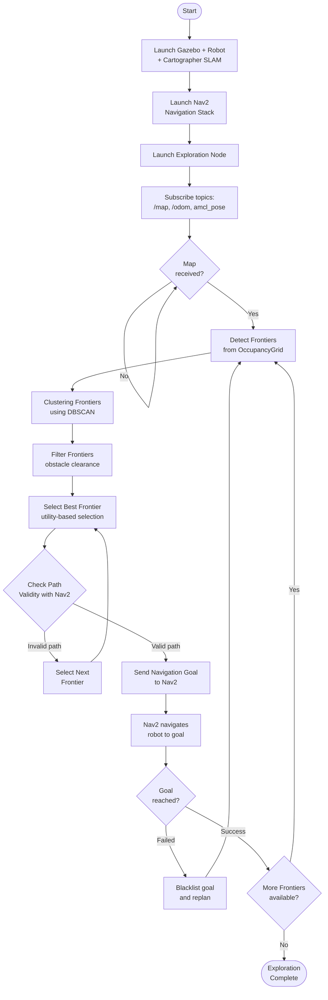

# Project Report: Autonomous Map Exploration System for Smart Warehouse AGV

## Table of Contents
1. [Technology Stack](#part-1-technology-stack)
2. [Technical Specifications](#part-2-technical-specifications)
3. [Autonomous Map Exploration System Design](#part-3-autonomous-map-exploration-system-design)

---

## Part 1: Technology Stack

The AGV project for Smart Warehouse has been built based on the following technologies and frameworks:

### 1.1. Containerization & Deployment Technologies
- **Docker Engine** (≥ 20.10): Container runtime for packaging the entire system
- **Docker Compose** (≥ 2.20): Container orchestration and management
- **NVIDIA Container Toolkit**: GPU support for Gazebo simulation (optional)

### 1.2. Robot Operating System (ROS)
- **ROS 2 Jazzy Jalisco**: Latest ROS2 version, providing middleware and framework for robotics
- **ROS 2 Packages**:
  - `nav2`: Navigation stack for autonomous navigation
  - `cartographer_ros`: SLAM (Simultaneous Localization and Mapping) framework
  - `ros_gz_sim`: Bridge between ROS2 and Gazebo Harmonic
  - `ros_gz_bridge`: Communication between ROS2 topics and Gazebo topics
  - `turtlebot3_*`: Packages for TurtleBot3 robot model

### 1.3. Simulation & Visualization
- **Gazebo Harmonic**: 3D physics simulation environment for robots
- **RViz2**: Visualization and debugging tool for ROS2

### 1.4. Navigation & SLAM
- **Nav2 (Navigation2)**: Navigation framework with components:
  - `nav2_planner`: Global path planning (NavfnPlanner with A*)
  - `nav2_controller`: Local path following (DWB Local Planner)
  - `nav2_costmap_2d`: Costmap for obstacle avoidance
  - `nav2_amcl`: Adaptive Monte Carlo Localization (not used in exploration, only used with static map)
  - `nav2_bt_navigator`: Behavior Tree Navigator
- **Cartographer**: Google's SLAM framework for real-time mapping
  - `cartographer_node`: Main node performing SLAM
  - `cartographer_occupancy_grid_node`: Converts SLAM output to OccupancyGrid

### 1.5. Robot Model
- **TurtleBot3 Waffle Pi**: Robot model for simulation, development and testing
- **Tugbot**: Industrial AGV model (used in warehouse world)

### 1.6. Programming Languages & Libraries
- **Python 3**: Main language for exploration node
- **NumPy**: Array processing and vectorized computation
- **SciPy**: Scientific algorithms (binary_dilation for frontier detection)
- **scikit-learn**: DBSCAN clustering for frontier grouping
- **rclpy**: ROS2 Python client library

### 1.7. Configuration & Build Tools
- **YAML**: Format for configuration files (Nav2 params, exploration params)
- **Lua**: Configuration for Cartographer SLAM
- **colcon**: Build system for ROS2 workspace

### 1.8. Version Control & Development
- **Git**: Version control system
- **Bash**: Shell scripting for automation scripts

---

## Part 2: Technical Specifications

### 2.1. Large Warehouse Map Overview

#### 2.1.1. General Information
- **Source**: Based on [MovAi Tugbot Warehouse](https://app.gazebosim.org/MovAi/worlds/tugbot_warehouse) from Gazebo Fuel
- **Purpose**: Large-scale warehouse simulation environment for AGV testing and development
- **Compatibility**: Modified to be compatible with Gazebo Harmonic and ROS2 Jazzy

#### 2.1.2. Dimensions and Structure
- **Overall dimensions**: 
  - Ground plane: **100m x 100m**
  - Main operational area: **~35m x 50m**
    - X coordinates: from -9.3m to 14.7m
    - Y coordinates: from -24.3m to 15.3m
- **Aisle width**: **~3m** between shelves
- **Map resolution**: **0.05m/pixel** (5cm per cell)

#### 2.1.3. Warehouse Components

| Component | Quantity | Description |
|-----------|----------|-------------|
| **Shelves** | 16 | Including 11 regular shelves and 5 large shelves |
| **Pallet boxes** | 5 | Pallet boxes placed in warehouse |
| **Cart** | 1 | Mobile cart |
| **Charging Station** | 1 | Tugbot-compatible charging station at coordinates (14.7, -10.6) |

### 2.2. Robot Technical Specifications (TurtleBot3 Waffle Pi & Tugbot)

At the current stage, the system uses **TurtleBot3 Waffle Pi** as the simulation platform, but parameters have been **scaled** and **customized** to simulate the behavior of a **Tugbot Industrial AGV** in a large warehouse.

#### 2.2.1. Dimensions & Weight
- **TurtleBot3 Waffle Pi (real robot)**:
  - Dimensions (L x W x H): **281 mm x 306 mm x 141 mm**
  - Weight: **1.8 kg** (including SBC, battery, sensors)
- **Tugbot (industrial AGV, simulated)**:
  - Length: **~0.7 m** (calculated from caster back at -0.225m to caster front at 0.145m, plus clearance)
  - Width: **~0.56 m** (wheel separation 0.514m + wheel width 0.05m)
  - Weight: **46.2 kg** (according to model.sdf)
  - Wheel separation: **0.514 m**
  - Wheel radius: **0.195 m**
  - Robot radius used in Nav2: **0.35 m** (calculated from center to farthest point along length)
  - Typical inflation radius: **0.55 – 0.6 m**

#### 2.2.2. Performance & Velocity
- **TurtleBot3 Waffle Pi (original spec):**
  - Maximum linear velocity: **0.26 m/s**
  - Maximum angular velocity: **1.82 rad/s** (~104.27°/s)
  - Maximum payload: **30 kg**
- **Simulated Industrial AGV (3x scale):**
  - **Scale factor**: 3x compared to TurtleBot3
  - Simulated linear velocity: **0.78 m/s**
  - Simulated angular velocity: **~2.0 rad/s**
  - Expected exploration time: **~20 minutes** for warehouse ~35m x 50m (instead of ~60 minutes if using 0.26 m/s speed)

#### 2.2.3. Sensor Suite

**LiDAR on Tugbot (simulated in Gazebo):**
- Sensor type: **gpu_lidar** (2D LiDAR, similar to LDS-01/LDS-02)
- Detection range: **0.60 m – 10.0 m** (according to model.sdf)
- Angular resolution: **1°** (360 samples for 360°)
- Update rate: **10 Hz**
- Range resolution: **0.015 m** (1.5 cm)
- Noise: Gaussian with stddev **0.005 m**
- Position: **0.221 m** forward, **0.1404 m** height from base_link
- Scan angle: **360°** (0.0 to 6.28 rad)

**IMU:**
- Update rate: **200 Hz**
- Angular velocity noise: Gaussian with stddev **2e-4**
- Linear acceleration noise: Gaussian with stddev **1.7e-2**
- Position: **0.14 m** forward, **0.02 m** right, **0.25 m** height from base_link

**Camera (TurtleBot3 Waffle Pi - reference):**
- Model: **Raspberry Pi Camera Module v2.1**
- Purpose: Vision perception, ready for QR/AR tag recognition at shelves or charging station
- **Note:** Current Tugbot model does not have camera in SDF, only LiDAR and IMU

**Charging Station:**
- Position: **(14.7, -10.6)** in map frame
- Compatible with Tugbot model in warehouse world

---

## Part 3: Autonomous Map Exploration System Design

The `agv_auto_explore` package is designed to perform autonomous exploration using **Frontier-based Exploration Algorithm** combined with Nav2 Navigation Stack.

### 3.1. Overall Workflow



### 3.2. Frontier-Based Exploration Algorithm

#### 3.2.1. Frontier Concept

**Frontier** are **free space** cells (value 0-49 in OccupancyGrid) that are **adjacent** to **unknown** cells (value -1). This is the boundary between explored and unexplored regions.

#### 3.2.2. Algorithm Steps

**Step 1: Frontier Detection**
- Use vectorized operations with NumPy and SciPy
- Create masks for free space and unknown space
- Use `scipy.ndimage.binary_dilation` with 8-connected structuring element to find free space cells adjacent to unknown
- Convert from grid coordinates to world coordinates

**Step 2: Frontier Clustering**
- Use **DBSCAN** (Density-Based Spatial Clustering of Applications with Noise)
- **Important parameters**:
  - `cluster_tolerance` (eps): 0.5m - maximum distance between points in the same cluster
  - `min_frontier_size`: 8 points - minimum number of points to form a valid cluster
- Purpose: Group nearby frontier points into clusters, then calculate centroid of each cluster

**Step 3: Obstacle Filtering**
- Check clearance around each frontier centroid
- **Parameter**: `obstacle_clearance`: 0.5m
- Remove frontiers too close to obstacles (value > 50 in OccupancyGrid)
- Use vectorized filtering to optimize performance

**Step 4: Goal Selection**
- **Utility-based selection**: Balance between **information gain** and **distance**
- **Information gain**: Estimate number of unknown cells within radius around frontier
  - `information_gain_radius`: 2.0m (can be scaled with map size)
- **Utility formula**: `utility = information_gain / (distance + 0.1)`
- **Additional filtering**:
  - `min_goal_distance`: 1.2m - minimum distance from robot to goal
  - Blacklist: Remove previously failed goals

**Step 5: Path Validation**
- Use Nav2 service `is_path_valid` to check if path can be found from robot to frontier
- Only select frontier if Nav2 can plan a valid path

**Step 6: Navigation**
- Send goal to Nav2 via `NavigateToPose` action
- Monitor navigation status (success/failure)
- Handle failure: blacklist goal and select next goal

### 3.3. Important Configuration Parameters

#### 3.3.1. Exploration Parameters (`exploration_params.yaml`)

```yaml
exploration_node:
  ros__parameters:
    # DBSCAN clustering
    cluster_tolerance: 0.5        # meters - maximum distance between points in cluster
    min_frontier_size: 8          # minimum points to form cluster
    
    # Safety margins
    obstacle_clearance: 0.5       # meters - safe distance from frontier to obstacle
    min_goal_distance: 1.2       # meters - minimum distance from robot to goal
    
    # Blacklist parameters
    blacklist_radius: 1.2         # meters - blacklist radius around failed goal
    max_blacklist_size: 25        # maximum number of goals in blacklist
    
    # Adaptive exploration (late-stage)
    min_frontier_size_final: 3    # reduce threshold when near completion
    adaptive_threshold: 0.70      # exploration ratio to activate adaptive mode
    
    # Information gain
    information_gain_radius: 2.0  # meters - radius to search for unknown cells
    scale_radius_with_map: true  # automatically scale radius with map size
```

**Parameter explanations:**

- **`cluster_tolerance`**: Maximum distance between frontier points to be considered in the same cluster. Larger value → fewer but larger clusters.

- **`min_frontier_size`**: Minimum number of frontier points to form a valid cluster. Larger value → only select large frontier regions, ignore small ones.

- **`obstacle_clearance`**: Safe distance from frontier to obstacle. Ensures robot does not select goals too close to walls or obstacles.

- **`min_goal_distance`**: Minimum distance from robot to goal. Prevents robot from selecting goals too close, wasting time.

- **`information_gain_radius`**: Radius to search for unknown cells around frontier. Larger value → prioritize frontiers with more unknown space around them.

- **`adaptive_threshold`**: When exploration reaches 70%, reduce `min_frontier_size` to `min_frontier_size_final` to find remaining small frontiers.

#### 3.3.2. Nav2 Exploration Parameters (`nav2_exploration_params.yaml`)

Nav2 parameters optimized for exploration in large warehouse:

**Controller Server (DWB Local Planner):**
```yaml
FollowPath:
  max_vel_x: 0.78              # m/s - maximum velocity (scaled 3x for industrial AGV)
  max_vel_theta: 2.0           # rad/s - maximum angular velocity
  acc_lim_x: 4.0               # m/s² - maximum acceleration
  sim_time: 2.5                # seconds - lookahead time for trajectory
  xy_goal_tolerance: 0.3       # meters - tolerance when reaching goal
```

**Local Costmap:**
```yaml
local_costmap:
  width: 10                    # meters - costmap width (scaled 2x)
  height: 10                   # meters - costmap height
  resolution: 0.05             # meters/pixel
  robot_radius: 0.22           # meters
  inflation_radius: 0.6         # meters - inflation radius
  update_frequency: 10.0       # Hz - update frequency
```

**Global Costmap:**
```yaml
global_costmap:
  track_unknown_space: true    # IMPORTANT: allow planning through unknown space
  resolution: 0.05             # meters/pixel
  robot_radius: 0.22           # meters
  inflation_radius: 0.6        # meters
```

**Planner Server:**
```yaml
GridBased:
  use_astar: true              # Use A* algorithm for path planning
  allow_unknown: true          # IMPORTANT: allow planning through unknown space
  tolerance: 0.3               # meters - tolerance for goal
```

**Important notes:**
- **`track_unknown_space: true`** and **`allow_unknown: true`**: These are **required** parameters for exploration. They allow Nav2 to plan paths through unknown space to reach frontiers.

- **`update_frequency`**: Higher costmap update frequency (10 Hz) to ensure quick response to map changes during exploration.

- **`sim_time`**: Longer lookahead time (2.5s) to match higher velocity (0.78 m/s).

#### 3.3.3. Cartographer SLAM Parameters (`turtlebot3_slam_tuned.lua`)

SLAM parameters optimized for large warehouse:

**Trajectory Builder (Local SLAM):**
```lua
TRAJECTORY_BUILDER_2D.min_range = 0.12      # meters
TRAJECTORY_BUILDER_2D.max_range = 8.0       # meters - effective lidar range
TRAJECTORY_BUILDER_2D.submaps.num_range_data = 120  # scans per submap
TRAJECTORY_BUILDER_2D.submaps.grid_options_2d.resolution = 0.10  # 10cm resolution
TRAJECTORY_BUILDER_2D.motion_filter.max_distance_meters = 0.2  # meters
```

**Pose Graph (Global SLAM - Loop Closure):**
```lua
POSE_GRAPH.optimize_every_n_nodes = 90       # optimize after every 90 nodes
POSE_GRAPH.constraint_builder.min_score = 0.65  # threshold for loop closure
POSE_GRAPH.constraint_builder.fast_correlative_scan_matcher.linear_search_window = 5.0
```

**Explanations:**
- **`max_range = 8.0m`**: Matches effective range of LDS-02 in indoor environments
- **`submaps.num_range_data = 120`**: Increase scans per submap to create larger, more stable submaps for large warehouse
- **`min_score = 0.65`**: Higher threshold to avoid false loop closures in environments with repetitive structures (shelves)

### 3.4. Features and Optimizations

#### 3.4.1. Vectorized Operations
- Use NumPy and SciPy for vectorized operations
- **Frontier detection**: Use `binary_dilation` instead of nested loops → **10-50x faster**
- **Obstacle filtering**: Has vectorized version for large frontier sets (>50 frontiers)

#### 3.4.2. Multi-threaded Architecture
- Use **MultiThreadedExecutor** with separate callback groups:
  - `service_group`: For service calls (IsPathValid)
  - `timer_group`: For planning timer
  - `map_callback_group`: For map updates
- **Asyncio event loop**: For async operations (path validation, planning)

#### 3.4.3. Stuck Detection & Recovery
- **Stuck detection**: Monitor robot position, if not moved significantly (>0.5m) in 30 seconds → considered stuck
- **Recovery**: When stuck:
  - Blacklist current goal
  - Cancel navigation
  - Replan with new goal

#### 3.4.4. Goal Blacklisting
- Store failed goals in blacklist
- **Blacklist radius**: 1.2m - goals within this radius will be removed
- **Auto-clear**: When blacklist too large (>50% frontiers), automatically clear old entries

#### 3.4.5. Adaptive Parameters
- **Late-stage adaptation**: When exploration reaches 70%, reduce `min_frontier_size` from 8 to 3
- Purpose: Find remaining small frontiers when near completion

#### 3.4.6. Visualization
- Publish **MarkerArray** to `/frontiers` topic for display in RViz2
- Each frontier displayed as green sphere
- Scale: 0.1m

#### 3.4.7. Exploration Progress Tracking
- Track exploration ratio: `explored_cells / total_cells`
- Periodic logging of status: map received, current goal, exploration percentage, blacklist size

### 3.5. Integration with Nav2

#### 3.5.1. Action Client
- Use `NavigateToPose` action client to send navigation goals
- Callbacks:
  - `goal_response_callback`: Handle acceptance/rejection
  - `get_result_callback`: Handle success/failure
  - `feedback_callback`: Log navigation feedback

#### 3.5.2. Service Client
- Use `IsPathValid` service to check path validity before sending goal
- Async call with 1 second timeout

#### 3.5.3. Topics Subscribed
- `/map`: OccupancyGrid from Cartographer
- `/odom`: Odometry from robot
- `amcl_pose`: AMCL pose (not used in exploration, only for monitoring)

#### 3.5.4. Topics Published
- `/frontiers`: MarkerArray for visualization
- `initialpose`: Initial pose estimate for AMCL (if needed)

---

## Conclusion

The autonomous map exploration system for AGV has been successfully designed and implemented with the following main components:

1. **Docker-based deployment**: Simplifies setup and deployment
2. **Frontier-based exploration**: Efficient algorithm for autonomous exploration
3. **Nav2 integration**: Smooth integration with navigation stack
4. **Cartographer SLAM**: High-quality map generation with loop closure
5. **Robustness features**: Stuck detection, recovery, blacklisting

The system has been tested and validated on warehouse simulation with dimensions ~35m x 50m, achieving good coverage in reasonable time.

---

**Author**: [Student Name]  
**Date**: [Completion Date]  
**Project**: AGV for Smart Warehouse - Autonomous Map Exploration
