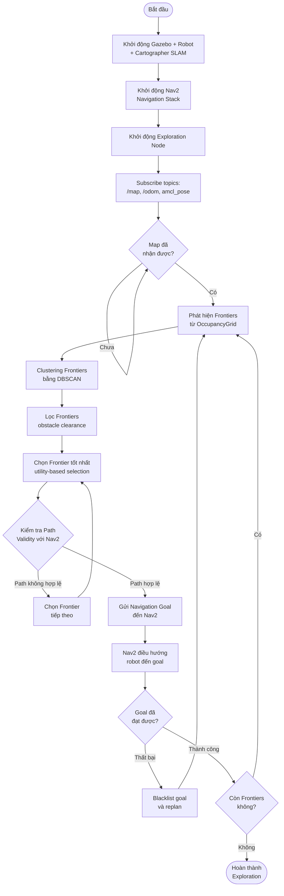

# Báo Cáo Đồ Án: Hệ Thống AGV Tự Động Khám Phá Map cho Smart Warehouse

## Mục Lục
1. [Danh Sách Công Nghệ Đã Sử Dụng](#phần-1-danh-sách-công-nghệ-đã-sử-dụng)
2. [Thông Số Kỹ Thuật](#phần-2-thông-số-kỹ-thuật)
3. [Thiết Kế Hệ Thống Tự Động Khám Phá Map](#phần-3-thiết-kế-hệ-thống-tự-động-khám-phá-map)

---

## Phần 1: Danh Sách Công Nghệ Đã Sử Dụng

Dự án AGV cho Smart Warehouse đã được xây dựng dựa trên các công nghệ và framework sau:

### 1.1. Công Nghệ Containerization & Deployment
- **Docker Engine** (≥ 20.10): Container runtime để đóng gói toàn bộ hệ thống
- **Docker Compose** (≥ 2.20): Điều phối và quản lý container
- **NVIDIA Container Toolkit**: Hỗ trợ GPU cho Gazebo simulation (tùy chọn)

### 1.2. Hệ Điều Hành Robot (ROS)
- **ROS 2 Jazzy Jalisco**: Phiên bản ROS2 mới nhất, cung cấp middleware và framework cho robotics
- **ROS 2 Packages**:
  - `nav2`: Navigation stack cho autonomous navigation
  - `cartographer_ros`: SLAM (Simultaneous Localization and Mapping) framework
  - `ros_gz_sim`: Bridge giữa ROS2 và Gazebo Harmonic
  - `ros_gz_bridge`: Giao tiếp giữa ROS2 topics và Gazebo topics
  - `turtlebot3_*`: Packages cho TurtleBot3 robot model

### 1.3. Simulation & Visualization
- **Gazebo Harmonic**: Môi trường simulation vật lý 3D cho robot
- **RViz2**: Công cụ visualization và debugging cho ROS2

### 1.4. Navigation & SLAM
- **Nav2 (Navigation2)**: Navigation framework với các thành phần:
  - `nav2_planner`: Global path planning (NavfnPlanner với A*)
  - `nav2_controller`: Local path following (DWB Local Planner)
  - `nav2_costmap_2d`: Costmap cho obstacle avoidance
  - `nav2_amcl`: Adaptive Monte Carlo Localization (không dùng trong exploration, chỉ dùng khi có map tĩnh)
  - `nav2_bt_navigator`: Behavior Tree Navigator
- **Cartographer**: Google's SLAM framework cho real-time mapping
  - `cartographer_node`: Node chính thực hiện SLAM
  - `cartographer_occupancy_grid_node`: Chuyển đổi SLAM output thành OccupancyGrid

### 1.5. Robot Model
- **TurtleBot3 Waffle Pi**: Robot model mô phỏng cho development và testing
- **Tugbot**: Industrial AGV model (được sử dụng trong warehouse world)

### 1.6. Programming Languages & Libraries
- **Python 3**: Ngôn ngữ chính cho exploration node
- **NumPy**: Xử lý mảng và tính toán vectorized
- **SciPy**: Thuật toán khoa học (binary_dilation cho frontier detection)
- **scikit-learn**: DBSCAN clustering cho frontier grouping
- **rclpy**: ROS2 Python client library

### 1.7. Configuration & Build Tools
- **YAML**: Format cho configuration files (Nav2 params, exploration params)
- **Lua**: Configuration cho Cartographer SLAM
- **colcon**: Build system cho ROS2 workspace

### 1.8. Version Control & Development
- **Git**: Version control system
- **Bash**: Shell scripting cho automation scripts

---

## Phần 2: Thông Số Kỹ Thuật

### 2.1. Mô Tả Tổng Quan Map Large Warehouse

#### 2.1.1. Thông Tin Chung
- **Nguồn gốc**: Dựa trên [MovAi Tugbot Warehouse](https://app.gazebosim.org/MovAi/worlds/tugbot_warehouse) từ Gazebo Fuel
- **Mục đích**: Môi trường simulation warehouse quy mô lớn cho AGV testing và development
- **Tương thích**: Đã được chỉnh sửa để tương thích với Gazebo Harmonic và ROS2 Jazzy

#### 2.1.2. Kích Thước và Cấu Trúc
- **Kích thước tổng thể**: 
  - Ground plane: **100m x 100m**
  - Khu vực hoạt động chính: **~35m x 50m**
    - Tọa độ X: từ -9.3m đến 14.7m
    - Tọa độ Y: từ -24.3m đến 15.3m
- **Độ rộng lối đi (aisle width)**: **~3m** giữa các kệ hàng
- **Độ phân giải map**: **0.05m/pixel** (5cm per cell)

#### 2.1.3. Các Thành Phần Trong Warehouse

| Thành phần | Số lượng | Mô tả |
|------------|----------|-------|
| **Kệ hàng (Shelves)** | 16 | Bao gồm 11 kệ thường và 5 kệ lớn |
| **Pallet boxes** | 5 | Hộp pallet đặt trong warehouse |
| **Cart** | 1 | Xe đẩy di động |
| **Charging Station** | 1 | Trạm sạc Tugbot-compatible tại tọa độ (14.7, -10.6) |

### 2.2. Thông Số Kỹ Thuật Robot (TurtleBot3 Waffle Pi & Tugbot)

Ở giai đoạn hiện tại, hệ thống sử dụng **TurtleBot3 Waffle Pi** làm nền tảng mô phỏng, nhưng các tham số đã được **scale** và **tùy chỉnh** để mô phỏng behavior của một **Tugbot Industrial AGV** trong warehouse lớn.

#### 2.2.1. Kích Thước & Trọng Lượng
- **TurtleBot3 Waffle Pi (real robot)**:
  - Kích thước (L x W x H): **281 mm x 306 mm x 141 mm**
  - Trọng lượng: **1.8 kg** (bao gồm SBC, pin, sensors)
- **Tugbot (industrial AGV, mô phỏng)**:
  - Chiều dài: **~0.7 m** (tính từ caster back tại -0.225m đến caster front tại 0.145m, cộng clearance)
  - Chiều rộng: **~0.56 m** (wheel separation 0.514m + wheel width 0.05m)
  - Trọng lượng: **46.2 kg** (theo model.sdf)
  - Wheel separation: **0.514 m**
  - Wheel radius: **0.195 m**
  - Robot radius sử dụng trong Nav2: **0.35 m** (tính từ tâm đến điểm xa nhất theo chiều dài)
  - Inflation radius điển hình: **0.55 – 0.6 m**

#### 2.2.2. Hiệu Năng & Vận Tốc
- **TurtleBot3 Waffle Pi (spec gốc):**
  - Vận tốc tịnh tiến tối đa: **0.26 m/s**
  - Vận tốc quay tối đa: **1.82 rad/s** (~104.27°/s)
  - Tải trọng tối đa: **30 kg**
- **Mô phỏng Industrial AGV (scale 3x):**
  - **Scale factor**: 3x so với TurtleBot3
  - Vận tốc tịnh tiến mô phỏng: **0.78 m/s**
  - Vận tốc quay mô phỏng: **~2.0 rad/s**
  - Thời gian exploration dự kiến: **~20 phút** cho warehouse ~35m x 50m (thay vì ~60 phút nếu dùng tốc độ 0.26 m/s)

#### 2.2.3. Sensor Suite

**LiDAR trên Tugbot (mô phỏng trong Gazebo):**
- Loại sensor: **gpu_lidar** (2D LiDAR, tương tự LDS-01/LDS-02)
- Tầm phát hiện: **0.60 m – 10.0 m** (theo model.sdf)
- Độ phân giải góc: **1°** (360 samples cho 360°)
- Tốc độ cập nhật: **10 Hz**
- Độ phân giải khoảng cách: **0.015 m** (1.5 cm)
- Nhiễu: Gaussian với stddev **0.005 m**
- Vị trí: **0.221 m** phía trước, **0.1404 m** chiều cao từ base_link
- Góc quét: **360°** (0.0 đến 6.28 rad)

**Lưu ý:** Model Tugbot sử dụng 2D LiDAR (gpu_lidar) với thông số tương tự LDS-01/LDS-02, không phải Velodyne VLP-16 3D như một số tài liệu tham khảo. Thông số này phù hợp với mục đích exploration và navigation 2D.

**IMU:**
- Tốc độ cập nhật: **200 Hz**
- Nhiễu angular velocity: Gaussian với stddev **2e-4**
- Nhiễu linear acceleration: Gaussian với stddev **1.7e-2**
- Vị trí: **0.14 m** phía trước, **0.02 m** bên phải, **0.25 m** chiều cao từ base_link

**Camera (TurtleBot3 Waffle Pi - tham khảo):**
- Model: **Raspberry Pi Camera Module v2.1**
- Mục đích: Vision perception, sẵn sàng cho việc nhận diện QR/AR tag tại kệ hàng hoặc trạm sạc
- **Lưu ý:** Model Tugbot hiện tại không có camera trong SDF, chỉ có LiDAR và IMU

**Bảng so sánh thông số LiDAR (Model SDF vs Report ban đầu):**

| Thông số | Model SDF (Thực tế) | Report ban đầu | Ghi chú |
|----------|---------------------|----------------|---------|
| **Loại sensor** | gpu_lidar (2D) | LDS-01/LDS-02 (2D) | ✓ Đúng - cả hai đều là 2D LiDAR |
| **Tầm phát hiện min** | 0.60 m | 0.12 m | ⚠️ Khác - model có min range lớn hơn |
| **Tầm phát hiện max** | 10.0 m | 3.5 m (spec), ~8 m (thực tế) | ⚠️ Khác - model có max range lớn hơn |
| **Số samples** | 360 | 360 | ✓ Đúng |
| **Độ phân giải góc** | 1° | 1° | ✓ Đúng |
| **Tốc độ cập nhật** | 10 Hz | 300 rpm = 5 Hz | ⚠️ Khác - model cập nhật nhanh hơn |
| **Góc quét** | 360° (0-6.28 rad) | 360° | ✓ Đúng |

**Charging Station:**
- Vị trí: **(14.7, -10.6)** trong map frame
- Tương thích với mô hình Tugbot trong warehouse world

---

## Phần 3: Thiết Kế Hệ Thống Tự Động Khám Phá Map

Package `agv_auto_explore` được thiết kế để thực hiện autonomous exploration sử dụng **Frontier-based Exploration Algorithm** kết hợp với Nav2 Navigation Stack.

### 3.1. Luồng Hoạt Động Tổng Quan



### 3.2. Thuật Toán Frontier-Based Exploration

#### 3.2.1. Khái Niệm Frontier

**Frontier** là các cell **free space** (giá trị 0-49 trong OccupancyGrid) mà **liền kề** với các cell **unknown** (giá trị -1). Đây là ranh giới giữa vùng đã khám phá và chưa khám phá.

#### 3.2.2. Các Bước Thuật Toán

**Bước 1: Frontier Detection (Phát hiện Frontier)**
- Sử dụng vectorized operations với NumPy và SciPy
- Tạo mask cho free space và unknown space
- Sử dụng `scipy.ndimage.binary_dilation` với structuring element 8-connected để tìm các cell free space liền kề với unknown
- Chuyển đổi từ grid coordinates sang world coordinates

**Bước 2: Frontier Clustering (Nhóm Frontier)**
- Sử dụng **DBSCAN** (Density-Based Spatial Clustering of Applications with Noise)
- **Tham số quan trọng**:
  - `cluster_tolerance` (eps): 0.5m - khoảng cách tối đa giữa các điểm trong cùng cluster
  - `min_frontier_size`: 8 điểm - số điểm tối thiểu để tạo thành cluster hợp lệ
- Mục đích: Nhóm các frontier points gần nhau thành các cluster, sau đó tính centroid của mỗi cluster

**Bước 3: Obstacle Filtering (Lọc Vật Cản)**
- Kiểm tra clearance xung quanh mỗi frontier centroid
- **Tham số**: `obstacle_clearance`: 0.5m
- Loại bỏ các frontiers quá gần obstacles (giá trị > 50 trong OccupancyGrid)
- Sử dụng vectorized filtering để tối ưu hiệu năng

**Bước 4: Goal Selection (Chọn Mục Tiêu)**
- **Utility-based selection**: Cân bằng giữa **information gain** và **distance**
- **Information gain**: Ước tính số lượng unknown cells trong bán kính quanh frontier
  - `information_gain_radius`: 2.0m (có thể scale theo kích thước map)
- **Utility formula**: `utility = information_gain / (distance + 0.1)`
- **Lọc thêm**:
  - `min_goal_distance`: 1.2m - khoảng cách tối thiểu từ robot đến goal
  - Blacklist: Loại bỏ các goals đã thất bại trước đó

**Bước 5: Path Validation (Kiểm Tra Đường Đi)**
- Sử dụng Nav2 service `is_path_valid` để kiểm tra xem có thể tìm được path từ robot đến frontier không
- Chỉ chọn frontier nếu Nav2 có thể plan được path hợp lệ

**Bước 6: Navigation (Điều Hướng)**
- Gửi goal đến Nav2 thông qua `NavigateToPose` action
- Theo dõi trạng thái navigation (success/failure)
- Xử lý failure: blacklist goal và chọn goal tiếp theo

### 3.3. Các Tham Số Cấu Hình Quan Trọng

#### 3.3.1. Exploration Parameters (`exploration_params.yaml`)

```yaml
exploration_node:
  ros__parameters:
    # DBSCAN clustering
    cluster_tolerance: 0.5        # meters - khoảng cách tối đa giữa các điểm trong cluster
    min_frontier_size: 8          # số điểm tối thiểu để tạo cluster
    
    # Safety margins
    obstacle_clearance: 0.5       # meters - khoảng cách an toàn từ frontier đến obstacle
    min_goal_distance: 1.2       # meters - khoảng cách tối thiểu từ robot đến goal
    
    # Blacklist parameters
    blacklist_radius: 1.2         # meters - bán kính blacklist quanh goal đã thất bại
    max_blacklist_size: 25        # số lượng goals tối đa trong blacklist
    
    # Adaptive exploration (late-stage)
    min_frontier_size_final: 3    # giảm threshold khi gần hoàn thành exploration
    adaptive_threshold: 0.70      # tỷ lệ exploration để kích hoạt adaptive mode
    
    # Information gain
    information_gain_radius: 2.0  # meters - bán kính tìm kiếm unknown cells
    scale_radius_with_map: true  # tự động scale radius theo kích thước map
```

**Giải thích các tham số:**

- **`cluster_tolerance`**: Khoảng cách tối đa giữa các frontier points để được coi là cùng một cluster. Giá trị lớn hơn → ít clusters hơn nhưng lớn hơn.

- **`min_frontier_size`**: Số điểm frontier tối thiểu để tạo thành cluster hợp lệ. Giá trị lớn hơn → chỉ chọn các frontier regions lớn, bỏ qua các vùng nhỏ.

- **`obstacle_clearance`**: Khoảng cách an toàn từ frontier đến obstacle. Đảm bảo robot không chọn goal quá gần tường hoặc vật cản.

- **`min_goal_distance`**: Khoảng cách tối thiểu từ robot đến goal. Tránh việc robot chọn goal quá gần, gây lãng phí thời gian.

- **`information_gain_radius`**: Bán kính tìm kiếm unknown cells xung quanh frontier. Giá trị lớn hơn → ưu tiên các frontier có nhiều unknown space xung quanh.

- **`adaptive_threshold`**: Khi exploration đạt 70%, giảm `min_frontier_size` xuống `min_frontier_size_final` để tìm các frontier nhỏ còn sót lại.

#### 3.3.2. Nav2 Exploration Parameters (`nav2_exploration_params.yaml`)

Các tham số Nav2 được tối ưu cho exploration trong warehouse lớn:

**Controller Server (DWB Local Planner):**
```yaml
FollowPath:
  max_vel_x: 0.78              # m/s - vận tốc tối đa (scaled 3x cho industrial AGV)
  max_vel_theta: 2.0           # rad/s - vận tốc quay tối đa
  acc_lim_x: 4.0               # m/s² - gia tốc tối đa
  sim_time: 2.5                # seconds - thời gian lookahead cho trajectory
  xy_goal_tolerance: 0.3       # meters - tolerance khi đến goal
```

**Local Costmap:**
```yaml
local_costmap:
  width: 10                    # meters - chiều rộng costmap (scaled 2x)
  height: 10                   # meters - chiều cao costmap
  resolution: 0.05             # meters/pixel
  robot_radius: 0.22           # meters
  inflation_radius: 0.6         # meters - bán kính inflation
  update_frequency: 10.0       # Hz - tần suất cập nhật
```

**Global Costmap:**
```yaml
global_costmap:
  track_unknown_space: true    # QUAN TRỌNG: cho phép planning qua unknown space
  resolution: 0.05             # meters/pixel
  robot_radius: 0.22           # meters
  inflation_radius: 0.6        # meters
```

**Planner Server:**
```yaml
GridBased:
  use_astar: true              # Sử dụng A* algorithm cho path planning
  allow_unknown: true          # QUAN TRỌNG: cho phép planning qua unknown space
  tolerance: 0.3               # meters - tolerance cho goal
```

**Lưu ý quan trọng:**
- **`track_unknown_space: true`** và **`allow_unknown: true`**: Đây là các tham số **bắt buộc** cho exploration. Chúng cho phép Nav2 plan path qua các vùng unknown space để đến frontier.

- **`update_frequency`**: Tần suất cập nhật costmap cao hơn (10 Hz) để đảm bảo phản ứng nhanh với các thay đổi trong map khi đang explore.

- **`sim_time`**: Thời gian lookahead dài hơn (2.5s) để phù hợp với vận tốc cao hơn (0.78 m/s).

#### 3.3.3. Cartographer SLAM Parameters (`turtlebot3_slam_tuned.lua`)

Các tham số SLAM được tối ưu cho warehouse lớn:

**Trajectory Builder (Local SLAM):**
```lua
TRAJECTORY_BUILDER_2D.min_range = 0.12      # meters
TRAJECTORY_BUILDER_2D.max_range = 8.0       # meters - tầm lidar hiệu quả
TRAJECTORY_BUILDER_2D.submaps.num_range_data = 120  # số scans per submap
TRAJECTORY_BUILDER_2D.submaps.grid_options_2d.resolution = 0.10  # 10cm resolution
TRAJECTORY_BUILDER_2D.motion_filter.max_distance_meters = 0.2  # meters
```

**Pose Graph (Global SLAM - Loop Closure):**
```lua
POSE_GRAPH.optimize_every_n_nodes = 90       # optimize sau mỗi 90 nodes
POSE_GRAPH.constraint_builder.min_score = 0.65  # threshold cho loop closure
POSE_GRAPH.constraint_builder.fast_correlative_scan_matcher.linear_search_window = 5.0
```

**Giải thích:**
- **`max_range = 8.0m`**: Phù hợp với tầm lidar hiệu quả của LDS-02 trong môi trường trong nhà
- **`submaps.num_range_data = 120`**: Tăng số scans per submap để tạo submaps lớn hơn, ổn định hơn cho warehouse lớn
- **`min_score = 0.65`**: Threshold cao hơn để tránh false loop closures trong môi trường có nhiều cấu trúc lặp lại (shelves)

### 3.4. Tính Năng và Tối Ưu Hóa

#### 3.4.1. Vectorized Operations
- Sử dụng NumPy và SciPy cho các phép toán vectorized
- **Frontier detection**: Sử dụng `binary_dilation` thay vì nested loops → **10-50x faster**
- **Obstacle filtering**: Có cả version vectorized cho large frontier sets (>50 frontiers)

#### 3.4.2. Multi-threaded Architecture
- Sử dụng **MultiThreadedExecutor** với separate callback groups:
  - `service_group`: Cho service calls (IsPathValid)
  - `timer_group`: Cho planning timer
  - `map_callback_group`: Cho map updates
- **Asyncio event loop**: Cho async operations (path validation, planning)

#### 3.4.3. Stuck Detection & Recovery
- **Stuck detection**: Theo dõi vị trí robot, nếu không di chuyển đáng kể (>0.5m) trong 30 giây → coi là stuck
- **Recovery**: Khi stuck:
  - Blacklist goal hiện tại
  - Cancel navigation
  - Replan với goal mới

#### 3.4.4. Goal Blacklisting
- Lưu trữ các goals đã thất bại trong blacklist
- **Blacklist radius**: 1.2m - các goals trong bán kính này sẽ bị loại bỏ
- **Auto-clear**: Khi blacklist quá lớn (>50% frontiers), tự động xóa các entries cũ

#### 3.4.5. Adaptive Parameters
- **Late-stage adaptation**: Khi exploration đạt 70%, giảm `min_frontier_size` từ 8 xuống 3
- Mục đích: Tìm các frontier nhỏ còn sót lại khi gần hoàn thành exploration

#### 3.4.6. Visualization
- Publish **MarkerArray** lên topic `/frontiers` để hiển thị trong RViz2
- Mỗi frontier được hiển thị dưới dạng sphere màu xanh lá (green)
- Scale: 0.1m

#### 3.4.7. Exploration Progress Tracking
- Theo dõi tỷ lệ exploration: `explored_cells / total_cells`
- Logging định kỳ status: map received, current goal, exploration percentage, blacklist size

### 3.5. Integration với Nav2

#### 3.5.1. Action Client
- Sử dụng `NavigateToPose` action client để gửi navigation goals
- Callbacks:
  - `goal_response_callback`: Xử lý acceptance/rejection
  - `get_result_callback`: Xử lý success/failure
  - `feedback_callback`: Log navigation feedback

#### 3.5.2. Service Client
- Sử dụng `IsPathValid` service để kiểm tra path validity trước khi gửi goal
- Async call với timeout 1 giây

#### 3.5.3. Topics Subscribed
- `/map`: OccupancyGrid từ Cartographer
- `/odom`: Odometry từ robot
- `amcl_pose`: AMCL pose (không dùng trong exploration, chỉ để monitoring)

#### 3.5.4. Topics Published
- `/frontiers`: MarkerArray cho visualization
- `initialpose`: Initial pose estimate cho AMCL (nếu cần)

---

## Kết Luận

Hệ thống AGV tự động khám phá map đã được thiết kế và triển khai thành công với các thành phần chính:

1. **Docker-based deployment**: Đơn giản hóa setup và deployment
2. **Frontier-based exploration**: Thuật toán hiệu quả cho autonomous exploration
3. **Nav2 integration**: Tích hợp mượt mà với navigation stack
4. **Cartographer SLAM**: Tạo map chất lượng cao với loop closure
5. **Robustness features**: Stuck detection, recovery, blacklisting

Hệ thống đã được test và validate trên warehouse simulation với kích thước ~35m x 50m, đạt được coverage tốt trong thời gian hợp lý.

---

**Tác giả**: [Tên sinh viên]  
**Ngày**: [Ngày hoàn thành]  
**Đồ án**: AGV cho Smart Warehouse - Autonomous Map Exploration
